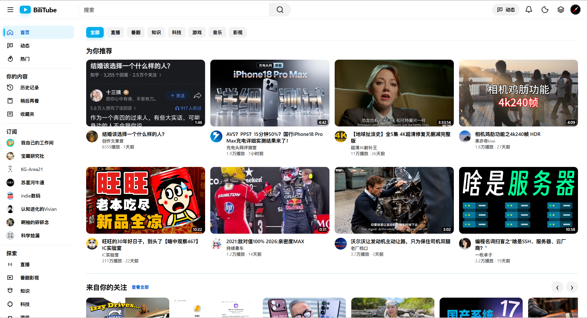
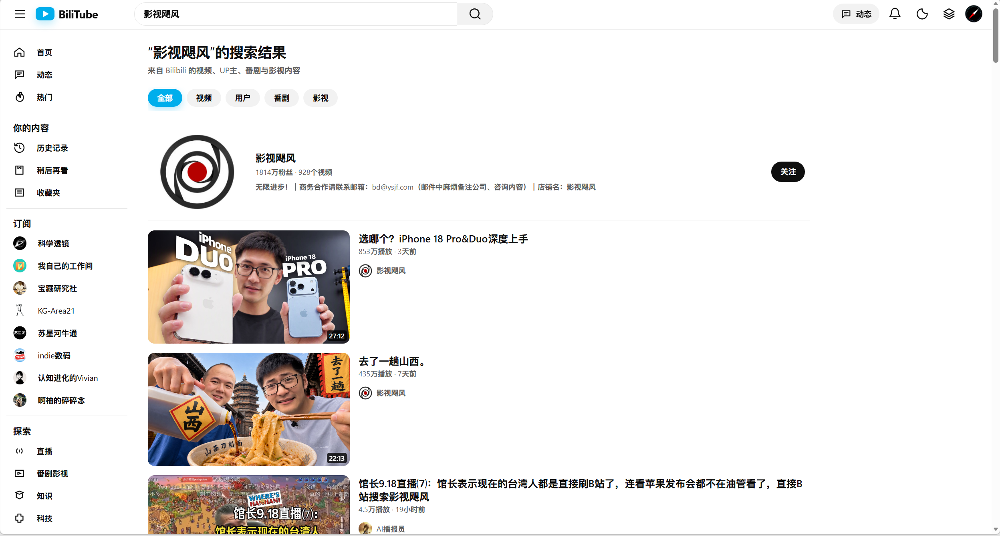

<p align="center">
  
</p>

<h1 align="center">BiliTube</h1>

<p align="center">Bilibili 桌面端界面扩展</p>

<p align="center">
  
  
  
  
</p>

BiliTube 是一个面向 Chromium 和 Edge 的 Manifest V3 浏览器扩展。项目提供统一的桌面导航、内容布局、主题和页面层级，用于改善 Bilibili 在大屏设备上的浏览体验。播放器、评论、互动工具栏和其他复杂业务仍由 Bilibili 原生页面负责。

当前源码版本：`0.12.4`。项目不依赖 npm 或 bundler，仓库目录本身就是可加载的未打包扩展。

## 功能范围

- 首页推荐网格、分类入口、关注/直播/番剧/热门内容 Shelf 和连续分页。
- 搜索建议、综合搜索、视频/用户/番剧/影视分类，以及标准浏览器链接行为。
- 动态、频道、历史记录、稍后再看和收藏夹页面的桌面端布局。
- 普通视频页的双栏布局、侧栏抽屉、主题切换和作者信息镜像。
- 缩略图 Hover Preview、预览进度条和“稍后再看”快捷操作。
- 外观、导航、首页内容、播放预览、动效、卡片信息、搜索和内容处理设置。

### 页面职责边界

| 页面或能力 | BiliTube | Bilibili |
| --- | --- | --- |
| 首页、搜索、动态、频道、历史、稍后再看、收藏夹 | 外层 Shell、导航、卡片布局、分页状态和视觉层 | 内容数据与业务接口 |
| 普通视频页 | Header、侧栏、双栏几何和有限样式适配 | 播放器、播放控制、简介、评论、相关推荐和互动工具栏 |
| 点赞、投币、收藏、分享、三连 | 不代理、不合成事件 | 原生按钮、弹窗和状态 |
| 普通链接 | 生成真实 `href`，保留左键、中键和 Ctrl/Command 点击行为 | 浏览器导航与 Bilibili 路由 |

这种边界用于保留 Bilibili 的登录态和原生业务能力，也降低站点 DOM 或接口变化对扩展的影响。需要查看完整路由和 Native-first 约束时，请参阅 [`docs/ARCHITECTURE.md`](docs/ARCHITECTURE.md) 和 [`docs/TECHNICAL_OVERVIEW.md`](docs/TECHNICAL_OVERVIEW.md)。

## 安装

1. 下载仓库 ZIP，或执行 `git clone https://github.com/QuentinCrane/BiliTube.git`。
2. 打开 Chrome 或 Edge 的扩展管理页：`chrome://extensions` 或 `edge://extensions`。
3. 开启“开发者模式”，选择“加载已解压的扩展”。
4. 选择包含 `manifest.json` 的仓库根目录，不要选择 `src` 或 `assets` 子目录。
5. 重新打开 Bilibili 标签页；更新源码或重新加载扩展后，也建议重新打开已有页面。
6. 在扩展详情页打开“扩展选项”，按需调整界面和内容设置。

首次使用不需要创建 BiliTube 账号。公开首页和搜索内容可以直接浏览；历史记录、订阅、动态、稍后再看和收藏夹等能力取决于当前 Bilibili 登录状态。

## 界面语言

扩展使用 Chromium 原生 `_locales` 机制，根据浏览器界面语言显示中文或英文：

- `zh_CN`：默认语言，简体中文。
- `en`：英文。

语言设置由浏览器决定，不会额外保存账号或个人资料。修改浏览器语言后，重新加载扩展和设置页即可生效。

## 验证

仓库没有必须执行的构建步骤。维护者可以在仓库根目录运行：

```powershell
node --test tests/*.test.js
node scripts/verify.mjs
git diff --check
```

前两条命令分别运行 Node.js 回归测试和 Manifest/资源/语法/架构校验。真实 Chrome 或 Edge 页面中的登录态、点击、导航和视觉结果仍需按照 [`PAGE_AUDIT.md`](PAGE_AUDIT.md) 手动检查。

## 截图

截图用于说明页面结构，不代表固定的推荐内容或接口返回值。

<p align="center">
  
  
</p>

<p align="center">
  
  
</p>

截图素材和隐私处理规则见 [`docs/screenshots/README.md`](docs/screenshots/README.md)。

## 项目结构

```text
.
├── _locales/              扩展界面翻译
├── assets/                扩展图标
├── docs/                  产品、架构、构建、测试、隐私和发布文档
│   └── screenshots/       README 和文档截图
├── scripts/               静态验证和 smoke 脚本
├── src/
│   ├── background.js      Manifest V3 service worker 与 Bilibili API
│   ├── core/              路由、数据、Shell、UI、Preview 和 Watch 运行时
│   ├── page/              页面桥接和 document_start 预布局
│   ├── options/           扩展设置页
│   └── styles/            预置样式和统一主题
├── tests/                 Node.js 回归测试和静态契约
└── manifest.json          Manifest V3 扩展入口
```

## 隐私与限制

BiliTube 没有自建服务器、账号系统、广告或云端同步。设置保存在浏览器的 `chrome.storage.local`，运行时缓存主要保留在内存中。扩展只访问 Manifest 中声明的 Bilibili 页面和资源域名，不向 BiliTube 自有服务上传用户数据。权限用途和数据边界见 [`docs/PRIVACY.md`](docs/PRIVACY.md)。

Bilibili 的页面 DOM、接口字段、WBI 参数和登录策略可能变化。未登录时，历史记录、动态、订阅、稍后再看和收藏夹可能为空；自动测试通过也不等同于当前 Bilibili 页面已经完成实机验收。

## 文档

- [`docs/BUILD_GUIDE.md`](docs/BUILD_GUIDE.md)：安装、开发循环、测试和发布包。
- [`docs/ARCHITECTURE.md`](docs/ARCHITECTURE.md)：运行时结构、路由策略和 Native-first 边界。
- [`docs/TESTING.md`](docs/TESTING.md)：自动测试与真实浏览器验收清单。
- [`docs/TECHNICAL_OVERVIEW.md`](docs/TECHNICAL_OVERVIEW.md)：页面能力、数据流和实现边界。
- [`docs/PRIVACY.md`](docs/PRIVACY.md)：权限和本地数据说明。
- [`CONTRIBUTING.md`](CONTRIBUTING.md)：贡献、测试和 Pull Request 约定。
- [`SECURITY.md`](SECURITY.md)：安全问题报告方式。
- [`CHANGELOG.md`](CHANGELOG.md)：版本变更记录。

## 许可与署名

BiliTube 使用 [MIT License](LICENSE)。版权署名为 `QuentinCrane`。Bilibili、YouTube 及相关商标和内容归其各自权利人所有；BiliTube 不代表 Bilibili 官方，也不改变 Bilibili 的服务条款。

```text
BiliTube — QuentinCrane
https://github.com/QuentinCrane/BiliTube
```

项目引用信息见 [`CITATION.cff`](CITATION.cff)。
